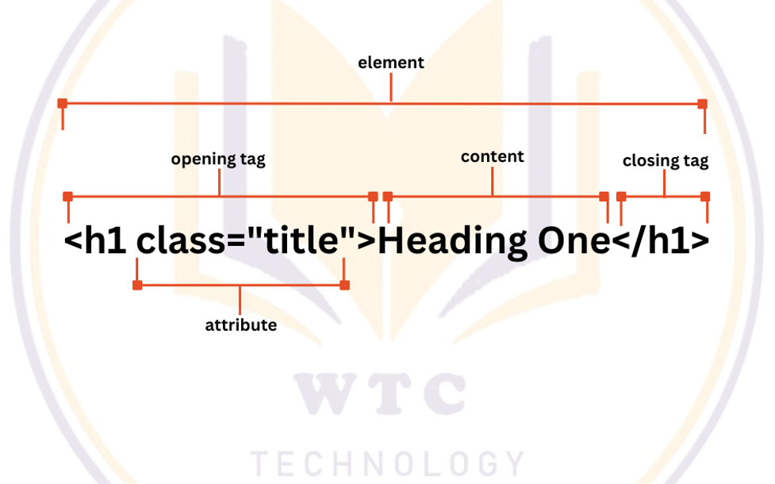

What is Hyper Text Markup Language?
===================================

HTML (HyperText Markup Language) is the most basic building block of the Web. It defines the meaning and structure of web content. Other technologies besides HTML are generally used to describe a web page's appearance/ presentation (CSS) or functionality/ behavior (JavaScript). "Hypertext" refers to links that connect web pages to one another, either within a single website or between websites. Links are a fundamental aspect of the Web. By uploading content to the Internet and linking it to pages created by other people, you become an active participant in the World Wide Web.


HTML Basic
==========

*   `<html>` : Every HTML code must be enclosed between basic HTML tags. It begins with `<html>` and ends with `</html>` tag.
*   `<head>` : The head tag comes next which contains all the header information of the web page or documents like the title of the page and other miscellaneous information. This information is enclosed within the head tag which opens with `<head>` and ends with `</head>`. The contents will of this tag will be explained in the later sections of the course.
*   `<title>` : We can mention the title of a web page using the `<title>` tag. This is header information and hence is mentioned within the header tags. The tag begins with `<title>` and ends with `</title>`.
*   `<body>` : Next step is the most important of all the tags we have learned so far. The body tag contains the actual body of the page which will be visible to all the users. This opens with `<body>` and ends with `</body>`. All content enclosed within this tag will be shown on the web page be it writings or images or audio or videos or even links. We will see later in the section how using various tags we may insert mentioned contents into our web pages.

HTML - Heading
==============

A HTML heading or HTML `h` tag can be defined as a title or a subtitle which you want to display on the webpage.h1 is the largest heading tag and h6 is the smallest one. So h1 is used for most important heading and h6 is used for least important.
|syntax|description|
|------|-------------|
|`<h1>`| `<h1>heading 1</h1>` |
|`<h2>`| `<h2>heading 2</h2>` |
|`<h3>`| `<h3>heading 3</h3>` |
|`<h4>`| `<h4>heading 4</h4>` |
|`<h5>`| `<h5>heading 5</h5>` |
|`<h6>`| `<h6>heading 6</h6>` |

HTML - Paragraph
================

HTML paragraph or HTML `p` tag is used to define a paragraph in a webpage. Let's take a simple example to see how it work. It is a notable point that a browser itself add an empty line before and after a paragraph. An HTML `<p>` tag indicates starting of new paragraph.

`<p>This is the first paragph.</p>`  
`<p>This is the second paragph.</p>`   
`<p>This is the third paragph.</p>`  

HTML - Tags
===========

HTML tags are like keywords which defines that how web browser will format and display the content. With the help of tags, a web browser can distinguish between an HTML content and a simple content. HTML tags contain three main parts: opening tag, content and closing tag. But some HTML tags are unclosed tags.

|syntax|description|
|------|-----------|
|`<b>bold tag </b>`|**bold tag**|
|`<strong>strong tag</strong>`|**strong tag**|
|`<i>italic tag </i>`|_italic tag_|
|`<em>emphasized tag</em>`|_emphasized tag_|
|`<u>underline tag</u>`|<ins>underline tag</ins>|
|`<mark>marked text</mark>`|<mark>marked text</mark>|
|`<small>smaller text</small>`|<small>smaller text</small>|
|`<del>deleted text</del>`|~~deleted text~~|
|`<ins>inserted text</ins>`|<ins>inserted text</ins>|
|`<sub>subscript</sub> text`|This is <sub>subscript</sub> text|
|`<sup>superscript</sup> text`|This is <sup>superscript</sup> text|
|`<abbr>abbreviation tag</abbr>`|<abbr>abbreviation tag</abbr>|
|`<dfn>definition tag</dfn>`|<dfn>definition tag</dfn>|
|`<blockquote>quoting tag</blockquote>`| <blockquote>quoting tag</blockquote>|
|`<q>short quote tag</q>`|<q>short quote tag</q>|
|`<code>code tag</code>`|`code tag`|
|`<kbd>keyboard tag</kbd>`|<kbd>keyboard tag</kbd>|
|`<address>address tag</address>`|<address>address tag</address>|

HTML - Text Links
=================

A webpage can contain various links that take you directly to other pages and even specific parts of a given page. These links are known as hyperlinks. Hyperlinks allow visitors to navigate between Web sites by clicking on words, phrases, and images. Thus you can create hyperlinks using text or images available on a webpage.

*   `<a href="https://hello.com">"Hello Website</a>`
*   `<a href="mailto: contact@hello.com">"Email To Me</a>`
*   `<a href="tel: +959123456">"Call Me</a>`
*   `<a href="myprofile.png” download">"Download Pic</a>`
*   `<a href="home.html#heading">"Heading</a>`

HTML - The target Attribute
===========================

*   `_blank` : Opens the linked document in a new window or tab.
*   `_self` : Opens the linked document in the same frame.
*   `_parent` : Opens the linked document in the parent frame.
*   `_top` : Opens the linked document in the full body of the window.

HTML - Images
=============

You can insert any image in your web page by using  tag. The  tag is an empty tag, which means that, it can contain only list of attributes and it has no closing tag. The alt attribute is a mandatory attribute which specifies an alternate text for an image, if the image cannot be displayed.

*   ``

HTML - Lists
============

HTML offers web authors three ways for specifying lists of information. Al lists must contain one or more list elements. Lists may contain -

*   `<ul>` - An unordered list. This will list items using plain bullets.
*   `<ol>` - An ordered list. This will use different schemes of numbers to list your items.

Unordered List
--------------
```html
<ul>                                         
    <li>list 1</li>                                         
    <li>list 2</li>                                         
    <li>list 3</li>                                         
    <li>list 4</li>                                         
    <li>list 5<li>                                     
</ul>
```
                            
Ordered List
------------
```html
<ol>                                         
    <li>list 1</li>                                         
    <li>list 2</li>                                         
    <li>list 3</li>                                         
    <li>list 4</li>                                         
    <li>list 5<li>                                     
</ol>
```

HTML - Media
============

Video
-----

*   The HTML `<video>` element is used to show a video on a web page.

```html
<video width="500" height="300" controls>
    <source src="movie.mp4" type="video/mp4">
    <source src="movie.ogg" type="video/ogg">
    Your browser does not support this video                                     
</video>
```

Audio
-----

*   The HTML `<audio>` element is used to play an audio file on a web page.
```html
<audio controls>                                            
    <source src="happy.ogg" type="type/ogg">                                         
    <source src="happy.mp3" type="type/mpeg">                                         
    Your browser does not support this audio.                                     
</audio>
```

## Youtube Video
```html
<iframe width="966" height="543" src="https://www.youtube.com/embed/oOjtEsVMacY?list=RDMM"></iframe>
```

HTML - Tables
=============

The HTML tables allow web authors to arrange data like text, images, links, other tables, etc. into rows and columns of cells. The HTML tables are created using the `<table>` tag in which the `<tr>` tag is used to create table rows and `<td>` tag is used to create data cells. The elements under `<td>` are regular and left aligned by default.

*   Table heading can be defined using `<th>` tag.
*   Cellpadding and Cellspacing Attributes
*   `<table border="1" cellpadding="5" cellspacing="5"></table>`
*   Colspan and Rowspan Attributes

```html
<table border="1">                     
    <tr>
        <th>Column 1</th>                                         
        <th>Column 2</th>                                         
        <th>Column 3</th>                                     
    </tr>                                 
    <tr>                                         
        <td rowspan="2">Row 1 Cell 1</td>                                         
        <td>Row 1 Cell 2</td>                                         
        <td>Row 1 Cell 3</td>                                     
    </tr>                                     
    <tr>                                         
        <td>Row 2 Cell 2</td>                                         
        <td>Row 2 Cell 3</td>                                     
    </tr>                                     
    <tr>                                         
        <td colspan="3">Row 3 Cell 1</td>                                     
    </tr>                                 
</table>
```

HTML - Forms
============

The HTML form element is used to create HTML Form
`<form></form>`

|attribute|description|
|---|---|
|action|`action(<form action=”login.php”></form>)`|
|target|`_blank(<form action=”login.php” target=”_blank”></form>)`<br>`_blank(<form action=”login.php” target=”_self”></form>)`<br>`_blank(<form action=”login.php” target=”_parent”></form>)`<br>`_blank(<form action=”login.php” target=”_top”></form>)`|
|method|`<form action=”login.php” method=”get”></form>`<br>`<form action=”login.php” method=”post”></form>`|
|autocomplete|`<form action=”login.php” autocomplete=”on”></form>`<br>`<form action=”login.php” autocomplete=”off”></form>`|

The HTML `<form>` element can have one or more following elements:

*   `<input>`
*   `<label>`
*   `<select>`
*   `<option>`
*   `<textarea>`
*   `<button>`
*   `<fieldset>`
*   `<legend>`
*   `<output>`
*   `<datalist>`
```html
<input list="languages" name="lang">                                             
<datalist id="languages">                                                 
    <option value="Javascript"></option>                                                 
    <option value="PHP"></option>                                                 
    <option value="Python"></option>                                                 
    <option value="Java"></option>                                                 
    <option value="C#"></option>                                             
</datalist>
```
*   `<optgroup>`
```html
<select name="type">                                                 
    <optgroup label="Backend Developer">                                                     
        <option value="php">PHP Developer</option>                         
        <option value="laravel">Laravel Developer</option>                     
    </optgroup>
    <optgroup label="Frontend Developer">                        
        <option value="react">React Developer</option>                         
        <option value="vue">Vue Developer</option>                     
    </optgroup>
</select>
```
    
Forms - Input Elements
----------------------

*   `<input type="button">`
*   `<input type="checkbox">`
*   `<input type="color">`
*   `<input type="date">`
*   `<input type="datetime-local">`
*   `<input type="email">`
*   `<input type="file">`
*   `<input type="hidden">`
*   `<input type="image" src=”img/photo.jpg” alt=”photo”>`
*   `<input type="month">`
*   `<input type="number">`
*   `<input type="password">`
*   `<input type="radio">`
*   `<input type="range" min=”10” max=”90” step=”10”>`
*   `<input type="reset">`
*   `<input type="search">`
*   `<input type="submit">`
*   `<input type="tel">`
*   `<input type="text">`
*   `<input type="time">`
*   `<input type="url">`
*   `<input type="week">`

Forms - Input Elements Attribute
--------------------------------

|attribute|description|
|---------|-----------|
|value|* `<input type="text" value="John">`<br> * specifies an initial value for an input field|
|readonly|*   `<input type="text" value="John" readonly>`<br>*   specifies that an input field is read-only.|
|disabled|*   `<input type="text" value="John" disabled>`  <br>*   specifies that an input field should be disabled.|
|size|*   `<input type="text" name="firstname" size="20">`  <br>*   specifies the visible width, in characters, of an input field.<br>*   The default value for size is 20|
|maxlength|*   `<input type="text" name="firstname" maxlength="5">`  <br>*   specifies the maximum number of characters allowed in an input field.|
|min|*   `<input type="date" name="dob" min="1980-11-31">`  <br>*   specify the minimum values for an input field.<br>*   min attributes work with the following input types: number, range, date, datetime-local, month, time and week.|
|max|*   `<input type="date" name="dob" max="2023-04-01">`  <br>*   specify the maximum values for an input field.<br>*   max attributes work with the following input types: number, range, date, datetime-local, month, time and week.<br>|
|multiple|*   `<input type="files" name="photos" multiple>`  <br>*   specifies that the user is allowed to enter more than one value in an input field.<br>*   attribute works with the following input types: email, and file.<br>|
|pattern|*   `<input type="text" name="code" pattern="\[A-Za-z\]{3}">`  <br>*   The input pattern attribute specifies a regular expression that the input field's value is checked against, when the form is submitted.<br>*   The pattern attribute works with the following input types: text, date, search, url, tel, email, and password. |
|placeholder |*   `<input type="text" name="firstname" placeholder="Enter Your First Name Here...">`  <br>*   The short hint is displayed in the input field before the user enters a value.<br>*   The placeholder attribute works with the following input types: text, search, url, tel, email, and password.<br>|
|required|*   `<input type="text" name="firstname" required>`  <br>*   The input required attribute specifies that an input field must be filled out before submitting the form.<br>*   The required attribute works with the following input types: text, search, url, tel, email, password, date pickers, number, checkbox, radio, and file.|
|step|*   `<input type="number" id="points" name="points" step="3">`  <br>*   The input step attribute specifies the legal number intervals for an input field.<br>*   Example: if step="3", legal numbers could be -3, 0, 3, 6, etc.<br>*   Tip: This attribute can be used together with the max and min attributes to create a range of legal values.<br>*   The step attribute works with the following input types: number, range, date, datetime-local, month, time and week.
|autofocus|*   `<input type="text" name="firstname" autofocus>`<br>*   The input autofocus attribute specifies that an input field should automatically get focus when the page loads.|
|list|* The input list attribute refers to a element that contains pre-defined options for an  element.<br> `<input list="browsers">`<br>`<datalist id="browsers">`<br>&nbsp;&nbsp;&nbsp;&nbsp;`<option value="Internet Explorer">Internet Explorer</option>`<br>&nbsp;&nbsp;&nbsp;&nbsp;`<option value="Firefox">Firefox</option>`<br>&nbsp;&nbsp;&nbsp;&nbsp;`<option value="Chrome">Chrome</option>`<br>&nbsp;&nbsp;&nbsp;&nbsp;`<option value="Opera">Opera</option>`<br>&nbsp;&nbsp;&nbsp;&nbsp;`<option value="Safari">Safari</option>`<br>`</datalist>`|
|autocomplete|`<input type="text" name="firstname" autocomplete="off">`<br>*   The input autocomplete attribute specifies whether a form or an input field should have autocomplete on or off.<br>*   Autocomplete allows the browser to predict the value. When a user starts to type in a field, the browser should display options to fill in the field, based on earlier typed values.<br>*   The autocomplete attribute works with `<form>` and the following `<input>` types: text, search, url, tel, email, password, datepickers, range, and color.|

Forms - Label Element
---------------------

*   defines a label for several form elements.
*   useful for screen-reader users, because the screen-reader will read out loud the label when the user focus on the input element.
*   help users who have difficulty clicking on very small regions (such as radio buttons or checkboxes) - because when the user clicks the text within the `<label>` element, it toggles the radio button/checkbox.
*   The `for` attribute of the `label` tag should be equal to the `id` attribute of the `input` element to bind them together.

Forms - Select Element
----------------------

*   The select element defines a drop-down list:
*   The options elements defines an option that can be selected.
*   By default, the first item in the drop-down list is selected.
*   To define a pre-selected option, add the selected attribute to the option:
```html
<select name="programming" id="programming" multiple>
    <option value="php">PHP</option>
    <option value="py">Python</option>
    <option value="js">Javascript</option>
    <option value="mysql">MySql</option>
</select>
```

Forms - Textarea Element
------------------------

*   defines a multi-line input field (a text area):
*   The rows attribute specifies the visible number of lines in a text area.
*   The cols attribute specifies the visible width of a text area.
*   `<textarea name="" id="" cols="30" rows="10"></textarea>`

Forms - Button Element
----------------------

*   defines a clickable button
*   `<button type="submit">Submit</button>`

Forms - Fieldset and Legend
---------------------------

*   The fieldset element is used to group related data in a form.
*   the legend element defines a caption for the fieldset element.
```html
<fieldset>
    <legend>Personal Information</legend>
    <label for="name">Name:</label>
    <input type="text" placeholder="Enter Your Name">
</fieldset>
```

all html elements tag => [click for more elements](https://developer.mozilla.org/en-US/docs/Web/HTML/Element)

**HTML Exercises**
* [portfolio - 1](https://htmlpreview.github.io/?https://github.com/thiri-win/wtc-learning-notes/blob/main/exercises/01_html-portfolio-1.html)
* [portfolio - 2](https://htmlpreview.github.io/?https://github.com/thiri-win/wtc-learning-notes/blob/main/exercises/02_html-portfolio-2.html)
* [travel agency](https://htmlpreview.github.io/?https://github.com/thiri-win/wtc-learning-notes/blob/main/exercises/03_html-travel.html)
* [table - 1](https://htmlpreview.github.io/?https://github.com/thiri-win/wtc-learning-notes/blob/main/exercises/04_html-table-1.html)
* [table - 2](https://htmlpreview.github.io/?https://github.com/thiri-win/wtc-learning-notes/blob/main/exercises/05_html-table-2.html)
* [form - 1](https://htmlpreview.github.io/?https://github.com/thiri-win/wtc-learning-notes/blob/main/exercises/06_html-form-1.html)
* [form - 2](https://htmlpreview.github.io/?https://github.com/thiri-win/wtc-learning-notes/blob/main/exercises/07_html-form-2.html)


