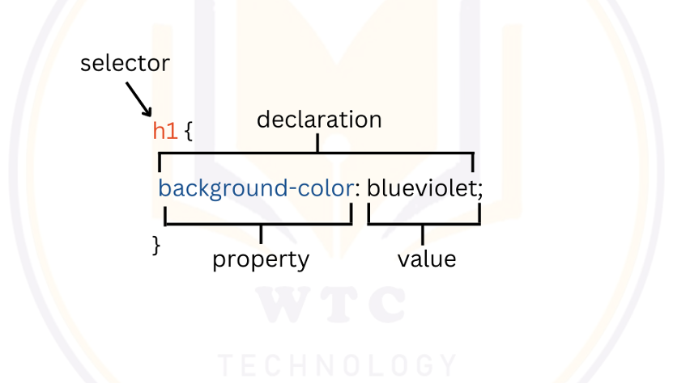

- [What is CSS?](#what-is-css)
- [How to link CSS?](#how-to-link-css)
  - [External Link](#external-link)
  - [Internal Link](#internal-link)
  - [Inline Attribute](#inline-attribute)
- [CSS Selector](#css-selector)
- [Pseudo Class](#pseudo-class)
- [Pseudo Element](#pseudo-element)
- [color](#color)
- [border](#border)
- [outline](#outline)
- [width](#width)
- [max-width](#max-width)
- [min-width](#min-width)
- [height](#height)
- [max-height](#max-height)
- [min-height](#min-height)
- [text-align](#text-align)
- [text-align-last](#text-align-last)
- [text-decoration](#text-decoration)
- [text-decoration-color](#text-decoration-color)
- [text-decoration-line](#text-decoration-line)
- [text-decoration-style](#text-decoration-style)
- [text-decoration-thickness](#text-decoration-thickness)
- [text-indent](#text-indent)
- [text-shadow](#text-shadow)
- [text-transform](#text-transform)
- [letter-spacing](#letter-spacing)
- [word-spacing](#word-spacing)
- [cursor](#cursor)
- [list-style](#list-style)
- [list-style-position](#list-style-position)
- [list-style-image](#list-style-image)
- [list-style-type](#list-style-type)
- [background](#background)
- [background-attachment](#background-attachment)
- [background-blend-mode](#background-blend-mode)
- [background-clip](#background-clip)
- [background-color](#background-color)
- [background-image](#background-image)
- [background-position](#background-position)
- [background-repeat](#background-repeat)
- [background-size](#background-size)
- [CSS values and units](#css-values-and-units)
- [font](#font)
- [font-family](#font-family)
- [font-size](#font-size)
- [font-style](#font-style)
- [font-weight](#font-weight)
- [padding](#padding)
- [margin](#margin)
- [box-sizing](#box-sizing)
- [box-model](#box-model)
- [opacity](#opacity)
- [transform](#transform)
- [transition](#transition)
- [float](#float)
- [position](#position)
- [z-index](#z-index)
- [animation](#animation)
- [animation-composition](#animation-composition)
- [animation-delay](#animation-delay)
- [animation-direction](#animation-direction)
- [animation-duration](#animation-duration)
- [animation-fill-mode](#animation-fill-mode)
- [animation-iteration-count](#animation-iteration-count)
- [animation-name](#animation-name)
- [animation-play-state](#animation-play-state)
- [animation-timing-function](#animation-timing-function)
- [display](#display)
- [flex](#flex)
- [flex-basis](#flex-basis)
- [flex-direction](#flex-direction)
- [flex-flow](#flex-flow)
- [flex-grow](#flex-grow)
- [flex-shrink](#flex-shrink)
- [flex-wrap](#flex-wrap)
- [justify-content](#justify-content)
- [justify-items](#justify-items)
- [justify-self](#justify-self)
- [align-items](#align-items)
- [align-content](#align-content)
- [align-self](#align-self)
- [grid](#grid)
- [grid-template-rows](#grid-template-rows)
- [grid-template-columns](#grid-template-columns)
- [grid-template](#grid-template)
- [Responsive Web Design](#responsive-web-design)
- [Media Queries](#media-queries)
- [The viewport meta tag](#the-viewport-meta-tag)

What is CSS?
============
*   used to make web pages presentable.
*   the first technology you should start learning after HTML.
*   While HTML is used to define the structure and semantics of your content, CSS is used to style it and lay it out.

How to link CSS?
================

External Link
-------------

The `<link>` HTML element specifies relationships between the current document and an external resource. This element is most commonly used to link to stylesheets, but is also used to establish site icons (both "favicon" style icons and icons for the home screen and apps on mobile devices) among other things.

Internal Link
-------------

The `<style>` HTML element contains style information for a document, or part of a document. It contains CSS, which is applied to the contents of the document containing the `<style>` element.

Inline Attribute
----------------

The `style` attribute allows to style an element using CSS declarations. It functions identically to the style attribute in HTML.

CSS Selector
============

In CSS, selectors are used to target the HTML elements on our web pages that we want to style. There are a wide variety of CSS selectors available, allowing for fine-grained precision when selecting elements to style. In this article and its sub-articles we'll run through the different types in great detail, seeing how they work.

1.  universal selector
2.  type selector (or) element selector
3.  class selector
4.  id selector
5.  attribute selector
6.  grouping selector
7.  descendant combinator
8.  child combinator
9.  adjacent sibling combinator(+)
10.  general sibling combinator(~)

Pseudo Class
============

A pseudo-class is a selector that selects elements that are in a specific state, e.g. they are the first element of their type, or they are being hovered over by the mouse pointer. They tend to act as if you had applied a class to some part of your document, often helping you cut down on excess classes in your markup, and giving you more flexible, maintainable code.

Ref: [More Info at developer.mozilla.org](https://developer.mozilla.org/en-US/docs/Web/CSS/:active)

|Pseudo Class|Explanation|
|------------|-----------|
|:active|commonly used on `<a>` and `<btton>` elements.|
|:checked|represents any radio(`<input type=”radio”>`), checkbox (`<input type=”checkbox”>`), or option (`<option>`) element that is checked or toggled to an on state.|
|:hover|triggered when the user hovers over an element with the cursor (mouse pointer).|
|:focus|represents an element (such as a form input) that has received focus.|
|:first-child|represents the first element among a group of sibling elements.|
|:last-child|represents the last element among a group of sibling elements.|
|:nth-child|matches elements based on their position among a group of siblings.|
|:nth-of-type()|matches elements based on their position among siblings of the same type (tag name).|
|:visited|applies once the link has been visited by the user.applies only `<a>` and `<area>` elements that have an href attribute.|
|:root|matches the root element of a tree representing the document.In HTML, :root represents the `<html>` element and is identical to the selector html, except that its specificity is higher.|

Pseudo Element
==============

A CSS pseudo-element is a keyword added to a selector that lets you style a specific part of the selected element(s).

Ref: [More Info at developer.mozilla.org](https://developer.mozilla.org/en-US/docs/Web/CSS/Pseudo-elements)

|Pseudo Element|Explanation|
|--------------|-----------|
|::first-letter|applies styles to the first letter of the first line of a block level element but only when not preceded by other content (such as images or inline tables).|
|::first-line|applies styles to the first line of a block level element|
|::before|creates a pseudo-element that is the first child of the selected element. It is often used to add cosmetic content to an element with the content property. It is inline by default.|
|::after|creates a pseudo-element that is the last child of the selected element.It is often used to add cosmetic content to an element with the content property. It is inline by default.|
|::placeholder|represents the placeholder text in an `<input>` or `<textarea>` element.|
|::selection|applies styles to the part of a document that has been highlighted by the user.|

color
=====

*   HEX colors(hexadecimal notation, the hexadecimal ranges are 0-9,A-F)
*   RGB(Red, Green, Blue)
*   HSL(Hue, Saturation, Lightness, hue ranges are 0-360deg, Saturation ranges are 0-100%, Lightness ranges are 0-100%)
*   Color Keywords(148 named colors in CSS, eg: purple, tomato, goldenrod, etc…)

border
======

*   A border provides a frame for your boxes.
*   border-style : (dotted, solid, groove, inset, dashed, double, ridge, outset)
*   to set border style of each side, you can use border-top-style, border-right-style, border-bottom-style, border-left-style
*   you can use border-color property to set the color of the border
*   to set border color of each side, you can use border-top-color, border-right-color, border-bottom-color, border-left-color
*   to set the thickness of border, you can use border-width property
*   to set each side of border-width, you can use border-top-width, border-right-width, border
*   `border` : Shorthand for `border-width`, `border-style`, and `border-color`
*   `border-style` : to set the appearance of the border(dotted, solid, groove, inset, dashed, double, ridge, outset)
*   `border-color` : to set the color of the border
*   `border-width` : to set the thickness of the border
*   `border-radius` : to set the rounded corners of the border

outline
=======

*   Outline is a line outside of the element's border. Unlike other areas of the box, outlines don't take up space, so they don't affect the layout of the document in any way.
*   `outline`: shorthand for `outline-color`, `outline-style`, `outline-width`

width
=====

*   The width CSS property sets an element's width.
*   By default, it sets the width of the content area, but if box-sizing is set to border-box, it sets the width of the border area.

max-width
=========

*   The max-width CSS property sets the maximum width of an element.
*   It prevents the used value of the width property from becoming larger than the value specified by max-width.

min-width
=========

*   The min-width CSS property sets the minimum width of an element.
*   It prevents the used value of the width property from becoming smaller than the value specified for min-width.

height
======

*   The height CSS property specifies the height of an element.
*   By default, the property defines the height of the content area. If box-sizing is set to border-box, however, it instead determines the height of the border area.

max-height
==========

*   The max-height CSS property sets the maximum height of an element.
*   It prevents the used value of the height property from becoming larger than the value specified for max-height.

min-height
==========

*   The min-height CSS property sets the minimum height of an element.
*   It prevents the used value of the height property from becoming smaller than the value specified for min-height.

text-align
==========

*   The text-align CSS property sets the horizontal alignment of the inline-level content inside a block element or table-cell box.
*   This means it works like vertical-align but in the horizontal direction.

text-align-last
===============

*   The text-align-last CSS property sets how the last line of a block or a line, right before a forced line break, is aligned.

text-decoration
===============

*   The text-decoration shorthand CSS property sets the appearance of decorative lines on text.
*   It is a shorthand for text-decoration-line, text-decoration-color, text-decoration-style, and the newer text-decoration-thickness property.

text-decoration-color
=====================

*   The text-decoration-color CSS property sets the color of decorations added to text by text-decoration-line.
*   The color applies to decorations, such as underlines, overlines, strikethroughs, and wavy lines like those used to mark misspellings, in the scope of the property's value.

text-decoration-line
====================

*   The text-decoration-line CSS property sets the kind of decoration that is used on text in an element, such as an underline or overline.

text-decoration-style
=====================

*   The text-decoration-style CSS property sets the style of the lines specified by text-decoration-line. The style applies to all lines that are set with text-decoration-line.

text-decoration-thickness
=========================

*   The text-decoration-thickness CSS property sets the stroke thickness of the decoration line that is used on text in an element, such as a line-through, underline, or overline.

text-indent
===========

*   The text-indent CSS property sets the length of empty space (indentation) that is put before lines of text in a block.

text-shadow
===========

*   The text-shadow CSS property adds shadows to text.
*   It accepts a comma-separated list of shadows to be applied to the text and any of its decorations.
*   Each shadow is described by some combination of X and Y offsets from the element, blur radius, and color.

text-transform
==============

*   The text-transform CSS property specifies how to capitalize an element's text.
*   It can be used to make text appear in all-uppercase or all-lowercase, or with each word capitalized. It also can help improve legibility for ruby.

letter-spacing
==============

*   The letter-spacing CSS property sets the horizontal spacing behavior between text characters.
*   This value is added to the natural spacing between characters while rendering the text.
*   Positive values of letter-spacing causes characters to spread farther apart, while negative values of letter-spacing bring characters closer together.

word-spacing
============

*   The word-spacing CSS property sets the length of space between words and between tags.

cursor
======

*   The cursor CSS property sets the mouse cursor, if any, to show when the mouse pointer is over an element.
*   The cursor setting should inform users of the mouse operations that can be performed at the current location, including: text selection, activating help or context menus, copying content, resizing tables, and so on.
*   You can specify either the type of cursor using a keyword, or load a specific icon to use (with optional fallback images and mandatory keyword as a final fallback).

list-style
==========

*   The list-style CSS shorthand property allows you to set all the list style properties at once.
*   formal syntax is list-style: `<list-style-position>` `<list-style-image>` `<list-style-type>`

list-style-position
===================

*   The list-style-position CSS property sets the position of the: marker relative to a list item.

list-style-image
================

*   The list-style-image CSS property sets an image to be used as the list item marker.

list-style-type
===============

*   The list-style-type CSS property sets the marker (such as a disc, character, or custom counter style) of a list item element.

background
==========

*   The background shorthand CSS property sets all background style properties at once, such as color, image, origin and size, or repeat method.
*   Component properties not set in the background shorthand property value declaration are set to their default values.
*   formal syntax is background:

background-attachment
=====================

*   The background-attachment CSS property sets whether a background image's position is fixed within the viewport, or scrolls with its containing block.

background-blend-mode
=====================

*   The background-blend-mode CSS property sets how an element's background images should blend with each other and with the element's background color.

background-clip
===============

*   The background-clip CSS property sets whether an element's background extends underneath its border box, padding box, or content box.

background-color
================

*   The background-color CSS property sets the background color of an element.

background-image
================

*   The background-image CSS property sets one or more background images on an element.

background-position
===================

*   The background-position CSS property sets the initial position for each background image. The position is relative to the position layer set by background-origin.

background-repeat
=================

*   The background-repeat CSS property sets how background images are repeated. A background image can be repeated along the horizontal and vertical axes, or not repeated at all.

background-size
===============

*   The background-size CSS property sets the size of the element's background image. The image can be left to its natural size, stretched, or constrained to fit the available space.

CSS values and units
====================
|units|Description|
|--------------|-----------|
|px|absolute length units — they are not relative to anything else, and are generally considered to always be the same size.|
|em||Font size of the parent, in the case of typographical properties like font-size, and font size of the element itself, in the case of other properties like width.|
|rem|relative to the size of root element.|
|vw|1% of the viewport's width.|
|vh|1% of the viewport's height.|
|%|it will be a percentage of the font-size of the element's parent|

font
====

*   The font CSS shorthand property sets all the different properties of an element's font.
*   Alternatively, it sets an element's font to a system font.

font-family
===========

*   The font-family CSS property specifies a prioritized list of one or more font family names and/or generic family names for the selected element.

font-size
=========

*   The font-size CSS property sets the size of the font. Changing the font size also updates the sizes of the font size-relative `<length>` units, such as em, ex, and so forth.

font-style
==========

*   The font-style CSS property sets whether a font should be styled with a normal, italic, or oblique face from its font-family.

font-weight
===========

*   The font-weight CSS property sets the weight (or boldness) of the font. The weights available depend on the font-family that is currently set.

padding
=======

*   The padding CSS shorthand property sets the padding area on all four sides of an element at once.

margin
======

*   The margin CSS shorthand property sets the margin area on all four sides of an element.

box-sizing
==========

*   The box-sizing CSS property sets how the total width and height of an element is calculated.

box-model
=========

*   Everything in CSS has a box around it, and understanding these boxes is key to being able to create more complex layouts with CSS, or to align items with other items. In this lesson, we will take a look at the CSS Box Model. You'll get an understanding of how it works and the terminology that relates to it.

opacity
=======

*   The opacity CSS property sets the opacity of an element. Opacity is the degree to which content behind an element is hidden, and is the opposite of transparency.

transform
=========

*   The transform CSS property lets you rotate, scale, skew, or translate an element. It modifies the coordinate space of the CSS visual formatting model.

transition
==========

*   The transition CSS property is a shorthand property for transition-property, transition-duration, transition-timing-function, and transition-delay.

float
=====

*   The float property is used for positioning and formatting content e.g., let an image float left to the text in a container.

position
========

*   The position CSS property sets how an element is positioned in a document. The top, right, bottom, and left properties determine the final location of positioned elements.
*   A positioned element is an element whose computed position value is either relative, absolute, fixed, or sticky. (In other words, it's anything except static.)
*   A relatively positioned element is an element whose computed position value is relative. The top and bottom properties specify the vertical offset from its normal position; the left and right properties specify the horizontal offset.
*   An absolutely positioned element is an element whose computed position value is absolute or fixed. The top, right, bottom, and left properties specify offsets from the edges of the element's containing block. (The containing block is the ancestor relative to which the element is positioned.) If the element has margins, they are added to the offset. The element establishes a new block formatting context (BFC) for its contents.
*   A stickily positioned element is an element whose computed position value is sticky. It's treated as relatively positioned until its containing block crosses a specified threshold (such as setting top to value other than auto) within its flow root (or the container it scrolls within), at which point it is treated as "stuck" until meeting the opposite edge of its containing block.

z-index
=======

*   The z-index CSS property sets the z-order of a positioned element and its descendants or flex items. Overlapping elements with a larger z-index cover those with a smaller one.

animation
=========

*   CSS animations make it possible to animate transitions from one CSS style configuration to another.
*   Animations consist of two components, a style describing the CSS animation and a set of keyframes that indicate the start and end states of the animation's style, as well as possible intermediate waypoints.

animation-composition
=====================

*   Specifies the composite operation to use when multiple animations affect the same property simultaneously. This property is not part of the animation shorthand property.

animation-delay
===============

*   Specifies the delay between an element loading and the start of an animation sequence and whether the animation should start immediately from its beginning or partway through the animation.

animation-direction
===================

*   Specifies whether an animation's first iteration should be forward or backward and whether subsequent iterations should alternate direction on each run through the sequence or reset to the start point and repeat.

animation-duration
==================

*   Specifies the length of time in which an animation completes one cycle.

animation-fill-mode
===================

*   Specifies how an animation applies styles to its target before and after it runs.

animation-iteration-count
=========================

*   Specifies the number of times an animation should repeat.

animation-name
==============

*   Specifies the name of the @keyframes at-rule describing an animation's keyframes.

animation-play-state
====================

*   Specifies whether to pause or play an animation sequence.

animation-timing-function
=========================

*   Specifies how an animation transitions through keyframes by establishing acceleration curves.

display
=======

*   The display CSS property sets whether an element is treated as a block or inline element and the layout used for its children, such as flow layout, grid or flex.
*   Formally, the display property sets an element's inner and outer display types. The outer type sets an element's participation in flow layout; the inner type sets the layout of children. Some values of display are fully defined in their own individual specifications; for example, the detail of what happens when display: flex is declared is defined in the CSS Flexible Box Model specification.
*   can set values to block, inline-block, none, flex, grid.

flex
====

*   The flex CSS shorthand property sets how a flex item will grow or shrink to fit the space available in its flex container.

flex-basis
==========

*   The flex-basis CSS property sets the initial main size of a flex item. It sets the size of the content box unless otherwise set with box-sizing.

flex-direction
==============

*   The flex-direction CSS property sets how flex items are placed in the flex container defining the main axis and the direction (normal or reversed).

flex-flow
=========

*   The flex-flow CSS shorthand property specifies the direction of a flex container, as well as its wrapping behavior.
*   formal syntax is flex-flow: `<flex-direction>` `<flex-wrap>`

flex-grow
=========

*   The flex-grow CSS property sets the flex grow factor, which specifies how much of the flex container's remaining space should be assigned to the flex item's main size.

flex-shrink
===========

*   The flex-shrink CSS property sets the flex shrink factor of a flex item. If the size of all flex items is larger than the flex container, items shrink to fit according to flex-shrink.
*   In use, flex-shrink is used alongside the other flex properties flex-grow and flex-basis, and normally defined using the flex shorthand.

flex-wrap
=========

*   The flex-wrap CSS property sets whether flex items are forced onto one line or can wrap onto multiple lines. If wrapping is allowed, it sets the direction that lines are stacked.

justify-content
===============

*   The CSS justify-content property defines how the browser distributes space between and around content items along the main-axis of a flex container, and the inline axis of a grid container.

justify-items
=============

*   The CSS justify-items property defines the default justify-self for all items of the box, giving them all a default way of justifying each box along the appropriate axis.

justify-self
============

*   The CSS justify-self property sets the way a box is justified inside its alignment container along the appropriate axis.

align-items
===========

*   The CSS align-items property sets the align-self value on all direct children as a group. In Flexbox, it controls the alignment of items on the Cross Axis. In Grid Layout, it controls the alignment of items on the Block Axis within their grid area.

align-content
=============

*   The CSS align-content property sets the distribution of space between and around content items along a flexbox's cross-axis or a grid's block axis.

align-self
==========

*   The align-self CSS property overrides a grid or flex item's align-items value. In Grid, it aligns the item inside the grid area. In Flexbox, it aligns the item on the cross axis.

grid
====

*   The grid CSS property is a shorthand property that sets all of the explicit and implicit grid properties in a single declaration. Using grid, you specify one axis using grid-template-rows or grid-template-columns.

grid-template-rows
==================

*   The grid-template-rows CSS property defines the line names and track sizing functions of the grid rows.

grid-template-columns
=====================

*   The grid-template-columns CSS property defines the line names and track sizing functions of the grid columns.

grid-template
=============

*   The grid-template CSS property is a shorthand property for defining grid columns, grid rows, and grid areas.

Responsive Web Design
=====================

*   Responsive web design (RWD) is a web design approach to make web pages render well on all screen sizes and resolutions while ensuring good usability. It is the way to design for a multi-device web. In this article, we'll help you understand some techniques that can be used to master it.

Media Queries
=============

*   Media queries allow us to run a series of tests (e.g., whether the user's screen is greater than a certain width, or a certain resolution) and apply CSS selectively to style the page appropriately for the user's needs.

The viewport meta tag
=====================

*   If you look at the HTML source of a responsive page, you will usually see the following `<meta>` tag in the `<head>` of the document.
*   `<meta name="viewport" content="width=device-width, initial-scale=1" />`
*   This viewport meta tag tells mobile browsers that they should set the width of the viewport to the device width, and scale the document to 100% of its intended size.